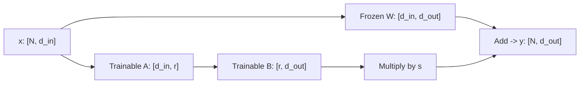
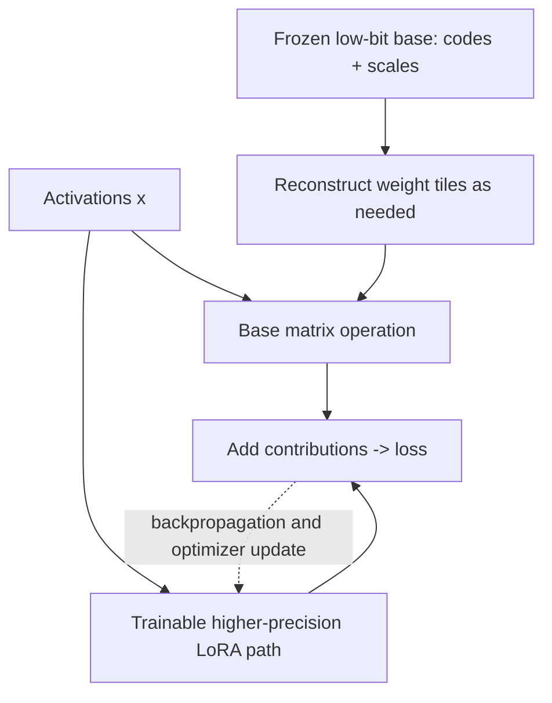

# Training and fine-tuning: what changes, what stays in memory

Fine-tuning takes an existing model and continues optimizing it for a chosen
objective. The infrastructure problem is larger than loading weights: you must
prepare targets correctly, fit the forward and backward passes, update parameters,
save reproducible artifacts, and prove that the update improved the intended task.

For this chapter, imagine converting a support ticket into:

```json
{"category": "billing", "priority": "normal"}
```

The goal is consistent classification and formatting on unseen tickets.
It is not to memorize a customer database or to make inference faster.

## 1. Establish what needs training

Build a small evaluation set before touching an optimizer. Include categories
that are easily confused, misspellings, mixed issues, irrelevant text, and tickets
that lack enough information.

Run a prompting baseline with a fixed schema. Score category accuracy, priority
accuracy, invalid outputs, and an explicit unknown/abstention policy. Measure
latency separately. If the baseline already meets the requirement, training adds
maintenance work without a demonstrated benefit.

Separate the data by meaningful units. If the same customer's nearly identical
tickets appear in training and validation, random row splitting can inflate the
score. Split by conversation, customer where appropriate, source, or time.
Keep a final test set untouched during experiment selection.

Training answers require a policy. A dataset containing inconsistent priorities
teaches inconsistency, however cleanly the training job runs.

## 2. Turn a conversation into supervised tokens

An SFT example contains a prompt and a target response. The model's chat template
renders the roles and delimiters into a token sequence. Use the template for the
actual checkpoint; similar role names do not imply interchangeable token formats.

Suppose rendering produces the abstract sequence:

```text
[USER] ticket text [ASSISTANT] {"category":"billing"} [EOS]
```

A common assistant-only objective masks user and template positions out of loss.
The assistant answer and its end marker are targets. Frameworks often represent
ignored labels with `-100`; that number is a convention, not a token the model
should generate.

For causal training:

```text
logits at position t predict the label at position t+1
```

Some APIs do this shift internally. Shifting both in the data pipeline and in
the model trains on the wrong targets. Inspect a decoded example alongside
input IDs, attention mask, and labels before a long run.

There are three separate masks to understand:

| Mask | Purpose |
| --- | --- |
| Causal attention | Prevent a position from using future tokens |
| Padding attention | Prevent padded positions from being treated as ordinary input |
| Loss mask | Select which predictions contribute to the objective |

Packing several examples into one sequence reduces padding. But masking the
loss does not prevent attention across example boundaries. Decide whether
cross-example context is allowed and configure the attention boundaries
accordingly. Also verify that truncation has not removed the assistant answer;
a batch with no supervised tokens must not be treated as useful training.

## 3. One optimizer step

A conventional training step does:

```text
batch -> forward pass -> masked loss -> backward pass
      -> optional gradient clipping -> optimizer update -> clear gradients
```

Backpropagation needs intermediate activations from the forward pass, unless
they are recomputed. The optimizer may maintain state for each trainable value.

If each GPU processes 2 examples per microbatch, gradients accumulate for 8
microbatches, and 4 data-parallel replicas participate:

```text
effective examples per optimizer update = 2 * 8 * 4 = 64
```

This is not 64 simultaneous inference requests. Accumulation increases the
effective training batch without holding every microbatch's activations at once.
It does not remove model or optimizer-state storage.

For variable-length examples, token accounting matters. If the first microbatch
has 100 supervised tokens and the second has 1,000, averaging their mean losses
equally weights the smaller microbatch's tokens ten times as heavily. Decide
whether the objective is example-weighted or token-weighted. Normalize the
accumulated gradient to match that objective.

Small batches can produce noisy gradients; large batches change optimization
dynamics and may require a different learning-rate schedule. Larger is not
automatically better.

## 4. Account for training memory

Consider one illustrative mixed-precision Adam setup with P trainable parameters:

```text
BF16 model weights:          2P bytes
BF16 gradients:             2P bytes
FP32 master weights:        4P bytes
two FP32 Adam moments:      8P bytes
----------------------------------
parameter-related storage: 16P bytes
```

Implementations differ: some have no separate master copy or store gradients
in another precision. Activations, temporary buffers, and fragmentation are
additional in every case.

For P=1 billion, this example is 16 decimal GB, about 14.9 GiB, before activations.
The same parameter count at four-bit weight storage is only about 0.5 decimal
GB before quantization metadata. This is why an inference fit says little about
full fine-tuning fit.

Activation memory depends strongly on microbatch size, sequence length, layer
width, and which intermediates are retained. Longer sequences can dominate even
when only a small subset of parameters is trainable.

Gradient checkpointing saves selected activations and recomputes others during
backpropagation. It exchanges extra compute for lower retained activation memory.
Mixed precision reduces some storage and arithmetic costs. BF16 has wider
exponent range than FP16; FP16 training often uses loss scaling to avoid
underflowing small gradients.

An optimizer's eight-bit state and four-bit model weights are separate techniques.
Record exactly which tensors use which precision.

## 5. LoRA: train an update instead of the whole matrix

For an existing projection W with shape `[d_in, d_out]`, use:

```text
y = x @ W + s * (x @ A) @ B
A: [d_in, rank]
B: [rank, d_out]
s: a configured scale, commonly alpha/rank
```

W stays frozen. A and B are trainable.



The branches are added, not concatenated. Both produce `[N, d_out]`.
For token activations, `N` can represent the flattened batch and sequence
dimensions. Only the adapter parameters are updated in this projection;
the frozen branch still participates in forward computation and in gradients
with respect to its input.

For a 4,096 by 4,096 matrix, full fine-tuning updates 16,777,216 values.
Rank 8 trains `4096*8 + 8*4096 = 65,536`, a factor of 256 fewer for that matrix.

Rank limits the update's capacity. Targeting only attention projections differs
from targeting attention plus feed-forward matrices. The names of those
projections vary by architecture; inspect which modules actually received adapters.

One common initialization gives A small random values and sets B to zero.
Initially the adapter contributes nothing, preserving the base model's function.
B can receive a gradient immediately; A's gradient initially contains B and can
be zero. Initializing both factors to zero would trap this simple parameterization
at a zero update.

For a downstream gradient G with respect to y:

```text
dB = s * (x @ A)^T @ G
dA = s * x^T @ G @ B^T
```

The base weight is frozen, but the forward pass still uses it. Gradients also
need to propagate through the network to reach adapters in earlier layers.
LoRA does not make the full training graph disappear.

Run the small adapter lab:

```powershell
python -m course.demos.lora
```

It fits a synthetic linear mapping with a deliberately rank-two target update.
That lets you inspect the gradients and verify that W stays unchanged. It is
an adapter-mechanics experiment, not an LLM quality result.

## 6. QLoRA: frozen low-bit base plus trainable adapters

QLoRA combines a quantized frozen base with adapter learning. The original work
also describes NF4, quantization of quantization constants, and paged optimizers.
These are distinct parts of the memory strategy.

Conceptually:

```text
stored base codes -> dequantized values used by matrix operation
                                      +
                               adapter contribution
```

Do not interpret "four-bit training" as four-bit gradients and four-bit arithmetic
everywhere. Adapter weights, activations, gradient computation, and optimizer
state have their own dtypes. The kernels and training library must support the
model architecture and GPU.



The dotted edge summarizes the adapter update, not an extra forward pass.
No optimizer update returns to the stored base codes. A fused implementation
can reconstruct tiles inside the matrix kernel rather than retaining an
entire high-precision copy of the base weights.

For a 6 GiB GPU, start with a small supported text model, short sequences, and
microbatch size one. The appropriate checkpoint is a training choice, not
necessarily the multimodal model already used for inference. Estimate memory,
then record actual peaks for one forward/backward/update cycle before scaling.

## 7. A practical GPU fine-tuning lab

This is the protocol for moving from the CPU adapter example to real SFT.
The [HF adaptation runner](../pipeline/HF.md) implements the single-device path;
[environment setup](../pipeline/ENVIRONMENTS.md) keeps its dependencies separate.
The course's NumPy examples do not install a training framework or perform this
GPU job. Running an offline tiny-model regression is also not a measured GPU
fine-tuning result.

1. Pin a small checkpoint revision, tokenizer revision, training-library versions,
   adapter targets, and dtype configuration. Confirm CUDA execution works.
2. Prepare a versioned JSONL dataset with the expected chat roles. Decode several
   tokenized examples and mark every position that contributes to loss.
3. Measure the base model on the held-out set. Retain its responses.
4. Overfit a deliberately tiny training subset first. If loss cannot fall, inspect
   targets, masks, gradient flow, and adapter targeting before adding more data.
5. Run one real optimizer step. Capture allocated/reserved GPU peaks, supervised
   tokens, forward/backward/update times, and whether every intended adapter
   receives finite gradients.
6. Train on the intended set with a fixed token budget. Evaluate at intervals;
   save optimizer and scheduler state if you need to resume.
7. Compare base and adapted models on the held-out tasks and on unrelated
   regression prompts. A lower training loss alone does not select a winner.

**Deliverables:** data policy and split, tokenized-example inspection, complete
configuration, loss curves, memory/timing observations, task scores, regression
results, and a loadable adapter.

Use the official PEFT and Transformers documentation linked below for the
installed versions rather than copying module names from another architecture.

## 8. Exporting and serving the result

An adapter is not a self-contained base model. Record:

```text
base model identity and revision
tokenizer and chat template
adapter configuration and weights
training data/version and hyperparameters
evaluation results
```

Serving can load base plus adapter or use merged weights:

```text
W_merged = W + s * A @ B
```

Merging into a low-bit representation can require dequantization and requantization,
with extra memory and another numerical change. An exported GGUF is not
automatically supported just because training succeeded in a different format.
Compare outputs before and after conversion.

### Check your understanding

Why can LoRA with few trainable parameters still run out of memory on long input?

<details>
<summary>Answer</summary>

The frozen base still occupies storage and participates in forward computation.
Activations and backward paths remain, and their cost grows with sequence length
and microbatch size. Reducing optimizer state is only one part of the budget.

</details>

References: [PEFT LoRA guide](https://huggingface.co/docs/peft/developer_guides/lora),
[Transformers training](https://huggingface.co/docs/transformers/training),
[LoRA paper](https://arxiv.org/abs/2106.09685),
[QLoRA paper](https://arxiv.org/abs/2305.14314).
