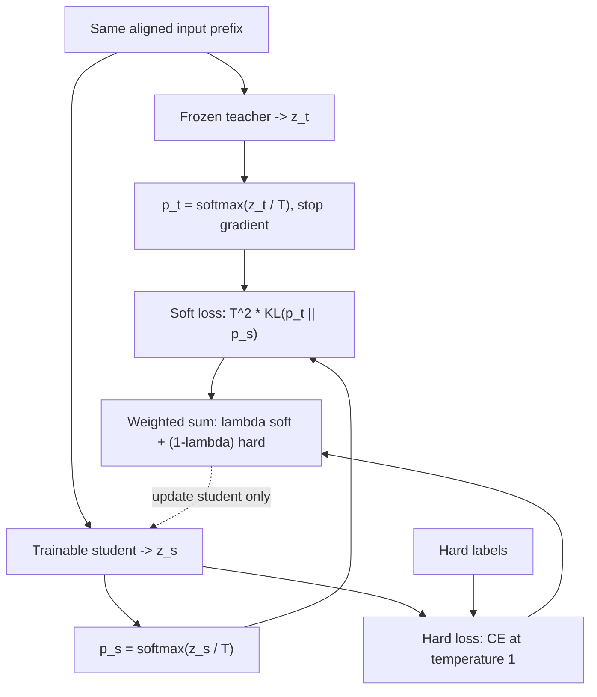

# Distillation: transferring behavior from a teacher

Distillation trains a student using information from a teacher. It is useful
when the teacher is expensive, inaccessible at deployment, or too large for the
target hardware. The student need not have the same architecture.

Unlike quantization, this is a new optimization problem. You need training
inputs, a teacher signal, a student objective, and an evaluation that checks
more than agreement with the teacher.

## 1. What can the teacher provide?

| Signal | Student objective | Main practical issue |
| --- | --- | --- |
| Hard labels | Predict the teacher's chosen label | Discards uncertainty |
| Generated responses | Learn to reproduce teacher-written sequences | Teacher errors become training targets |
| Token distributions | Match teacher probabilities | Large logits and vocabulary alignment |
| Hidden representations | Match projected intermediate features | Dimensions and layer meanings differ |
| Rankings/preferences | Prefer teacher-selected responses | Preference quality and coverage |

For a classifier, a teacher distribution might be:

```text
billing: 0.55, account: 0.40, technical: 0.05
```

The hard label says only `"billing"`. The distribution also shows that `"account"`
was plausible. That relationship can provide a richer learning signal than
the winning class alone.

It can also transmit uncertainty that is inappropriate for the student's task.
Teacher output is supervision, not unquestionable ground truth.

## 2. Temperature and soft targets

Let z_t be teacher logits and z_s student logits. With temperature T:

```text
p_t = softmax(z_t / T)
p_s = softmax(z_s / T)
```

Higher temperature spreads probability across alternatives. A common combined
objective is:

```text
loss = (1 - lambda) * CE(hard_labels, softmax(z_s))
     + lambda * T^2 * KL(p_t || p_s)
```

`lambda` controls teacher versus hard-label supervision. The `T^2` factor
compensates for temperature-related gradient scaling; its use is a convention
of this objective, not a guarantee that all temperatures train equally well.



There are two student probability distributions: the softened one for teacher
matching and the ordinary one for hard labels. The teacher contributes targets,
not trainable parameters. For token-level matching, "aligned" means the
positions and vocabulary entries refer to the same events.

For fixed teacher probabilities, minimizing teacher/student KL has the same
student gradient as minimizing cross-entropy with soft targets:

```text
CE(p_t, p_s) = -sum_i p_t[i] * log(p_s[i])
```

They differ by the teacher's entropy, which does not depend on student weights.
The absolute loss numbers differ, so label the quantity in your logs correctly.

For mean soft cross-entropy with the T-squared scale, the gradient with respect
to unscaled student logits is:

```text
gradient = T * (p_s - p_t) / batch_size
```

The derivative of `z_s/T` contributes `1/T`; multiplying by `T^2` leaves T.
This is an easy implementation detail to miss.

## 3. A runnable distillation experiment

```powershell
python -m course.demos.distillation
```

The lab uses three classes and a fixed linear teacher. The student has fewer
input features, so it cannot perfectly reproduce everything the teacher knows.
It compares hard-label training with temperature-scaled soft-target training,
then measures held-out agreement and KL divergence.

The teacher is a controlled numerical source, not a pretrained language model.
The lab exposes the objective and checks its gradient by finite differences.
It does not claim that one distillation setting always wins.

Before running, predict what happens if the student loses an input feature
that strongly affects the teacher. More training cannot restore missing
information; the student must approximate the conditional behavior available
from its own inputs.

## 4. Distilling autoregressive text

The [connected sequence-distillation lab](../pipeline/README.md#sequence-distillation)
turns saved teacher responses into a student training split and preserves
independent held-out labels. Unlike the soft-target classifier above, that path
uses teacher-generated token sequences, not vocabulary-level KL.

At token position t, both teacher and student predict a distribution given a
prefix. Matching logits is straightforward only when vocabulary entries and
token positions align.

Two models can tokenize the same string differently. Their next-token distributions
then live over different events; matching column 1000 to column 1000 is meaningless.
Options include compatible tokenizers, explicit alignment methods, or distilling
text sequences instead of raw token logits.

Offline sequence distillation has this workflow:

```text
prompt set -> teacher generation -> filtering/scoring
           -> student SFT -> held-out evaluation
```

It works even when the teacher exposes only text. Store teacher model/version,
prompt template, sampling settings, output budget, and filtering rules.
These choices define the data distribution.

Teacher-forced logit distillation scores a supplied prefix at each position.
But the deployed student conditions on its own outputs, including mistakes.
On-policy methods gather teacher feedback on student-generated prefixes to
address this mismatch. They cost additional generation and can require online
teacher access.

Generated reasoning traces can be part of training data. A long trace is not
necessarily correct, and explanations need not faithfully reveal how the
teacher arrived at its answer. Filter by task success and relevant criteria,
not just response length.

## 5. Why storing teacher logits is expensive

For 10,000 sequences of 2,048 tokens with a 100,000-token vocabulary in FP16:

```text
10,000 * 2,048 * 100,000 * 2 bytes
= 4,096,000,000,000 bytes
= about 4.096 decimal TB
```

That is only the logits, before metadata. It does not fit in a casual dataset
directory on a laptop.

Alternatives include teacher inference on demand, shorter sequences, compressed
outputs, top-k distributions, or sequence-level targets. Top-k probabilities
lose tail information; decide how to represent missing probability mass and
normalize the objective. Saving raw logits for selected tokens requires enough
information to reconstruct the intended distribution.

Online distillation avoids a huge cache but needs compute for both models,
possibly at the same time. Teacher forward inference does not need gradients,
while student training does. Budget the two separately and avoid retaining a
teacher backward graph accidentally.

## 6. Dataset quality and evaluation

A distillation dataset should cover the student's intended workload, including
rare cases, refusals or unknowns where required, and formatting constraints.
Teacher outputs on easy examples alone can hide failure on the long tail.

If the teacher is an external service, consider terms of use, data permissions,
privacy, cost, and rate limits. Do not send private training data to a provider
merely because generating examples is convenient.

Use at least three evaluation views:

| View | What it catches |
| --- | --- |
| Teacher agreement / distribution matching | Whether transfer happened |
| Independent task correctness | Shared teacher/student mistakes |
| Deployment constraints | Latency, memory, context support, output format |

A student can agree more with a flawed teacher and become worse on the real
task. It can also outperform a teacher in a narrow domain after learning from
additional reliable labels. Distillation is not defined as a fixed quality loss.

For classification, report confusion matrices and calibration where useful.
For text, use task-appropriate tests instead of exact string agreement when
multiple answers are valid. For code, check behavior on edge cases as well
as whether the generated function parses.

## 7. Distillation versus other compression choices

Weight quantization changes numerical representation. Pruning removes or
suppresses weights or structures. Distillation optimizes a student against
teacher information. They can be combined, but each introduces an evaluation
boundary.

A sensible sequence might be:

```text
base student -> task adaptation/distillation -> evaluate
             -> quantize -> evaluate again -> serve and measure
```

Do not attribute a speed or quality change to distillation if the comparison
also changes precision, tokenizer, context limit, and decoding configuration.

### Design exercise

Your teacher solves 92% of a task set. Your student matches the teacher on 98%
of outputs. Can you conclude the student solves 90.16%?

<details>
<summary>Answer</summary>

No. Agreement and correctness are not independent events. The disagreements
could fix teacher errors or introduce errors on previously correct cases.
Measure student correctness against independent targets.

</details>

References: [Distilling the Knowledge in a Neural Network](https://arxiv.org/abs/1503.02531),
[Sequence-Level Knowledge Distillation](https://arxiv.org/abs/1606.07947).
