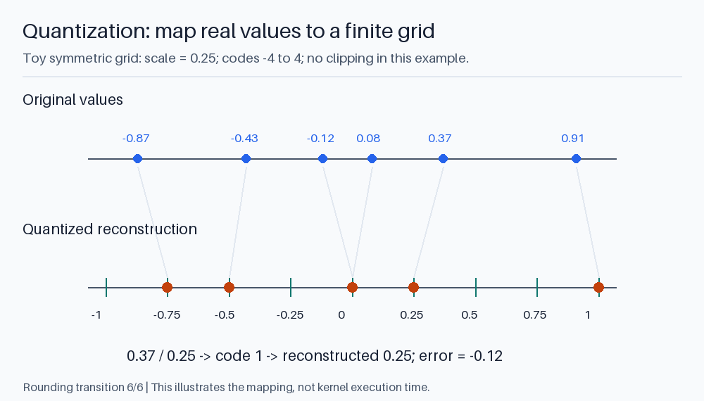
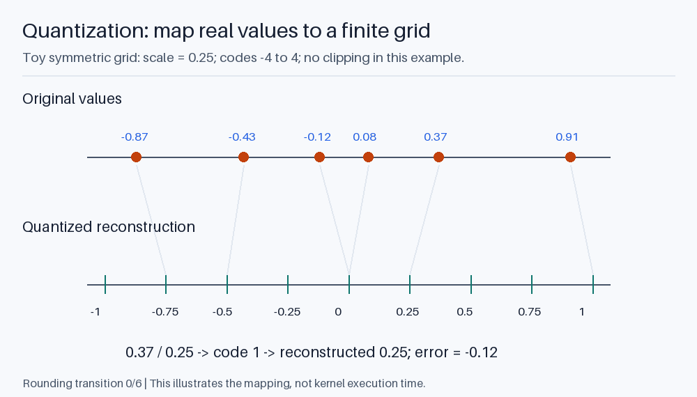

# Quantization: from an equation to an efficient kernel

Quantization represents values with a limited set of codes. The motivation is
smaller storage, lower memory traffic, or faster arithmetic. Which benefit you
get depends on the data being quantized and the kernel that consumes it.

Start by naming three things separately:

```text
storage format
compute/accumulation precision
which tensors use that format
```

An INT4 weight file does not imply INT4 activations or INT4 accumulation.
A GPU supporting a precision in hardware does not imply your runtime dispatches
an efficient kernel for your model at that precision.

## 1. Affine quantization

A common affine representation is:

```text
q = clip(round(x / scale) + zero_point, q_min, q_max)
x_reconstructed = scale * (q - zero_point)
```

The scale converts between real values and integer steps. The zero point lets
the code range represent an offset range of values.

For symmetric signed quantization, the zero point is zero. Using a signed range
from -127 to 127 and block maximum absolute value 2.54 gives scale 0.02.
Then 0.37 rounds to code 18 or 19 depending on rounding details and reconstructs
near 0.36 or 0.38. Values outside the represented range clip to an endpoint.

Rounding and clipping are different errors. If a rare value sets a huge scale,
small values may all round to zero. If you choose a smaller scale, that outlier
may clip instead. Calibration chooses a compromise for the expected inputs.

All-zero groups need explicit handling: dividing by zero is not a compression
method. The quantization lab sets their codes and scales consistently.



<details>
<summary>Animate rounding onto a quantization grid</summary>



</details>

The horizontal displacement is rounding error; the vertical movement only
separates the two number lines. This nine-code teaching grid is not INT4,
NF4, or a GGUF format. All values are inside its range, so it demonstrates
rounding but not clipping. Stored codes also need a scale to reconstruct values.

## 2. Granularity and outliers

**Per-tensor** quantization uses one scale for a tensor.
**Per-channel** uses separate scales along a selected axis.
**Group-wise** uses a scale for small groups, often within a weight row.

Suppose most weights lie between -0.1 and 0.1 but one is 10. A shared symmetric
INT8 scale is about `10/127 = 0.0787`. Most small weights have only a few codes
available. Grouping can confine that coarse scale to the group containing the
outlier.

Smaller groups preserve local precision but require more scales and often more
kernel work. Tensor layout determines which elements share a scale; "group
size 32" without an axis or layout is incomplete configuration.

If N values use b-bit codes and each group of G values stores S metadata bytes:

```text
approximate bytes = N * b/8 + ceil(N/G) * S
```

Add alignment and any unquantized tensors. For 1,024 values with four-bit codes
and one two-byte scale per 32 values:

```text
codes: 512 bytes
scales: 32 * 2 = 64 bytes
total: 576 bytes, not 512
```

That is the code-plus-scale size of a simple format, not a universal definition
of every four-bit quantization.

## 3. Storage precision versus multiplication precision

A weight-only operation may conceptually do:

```text
low-bit codes -> reconstruct a tile -> multiply with FP16/BF16 activations
              -> accumulate in a suitable precision
```

Optimized kernels fuse decoding of weight codes with the matrix operation.
Materializing a full FP16 copy first can lose much of the intended memory benefit.

INT8 matrix multiplication can instead use quantized activations and integer
arithmetic, with rescaling and an appropriate accumulator. FP8 formats use
floating-point encodings with different exponent/mantissa tradeoffs.
FP4, INT4, and NF4 are not interchangeable names.

W4A16 commonly means four-bit weights with 16-bit activations.
W8A8 commonly means eight-bit weights and activations.
These names still leave scale layout, accumulation, and kernel details unspecified.

The same quantized checkpoint can perform differently across CPU, CUDA backend,
GPU architecture, and batch size. Prefill and decode also have different matrix
shapes. Compare both stages when deciding whether a format is a performance win.

## 4. PTQ, calibration, and QAT

**Post-training quantization (PTQ)** quantizes an already-trained model.
Some schemes only inspect weight values; others use calibration inputs to
estimate which errors matter to activations or outputs.

Calibration should resemble deployment: language, sequence lengths, code versus
prose, and input style can affect activation ranges. Keep calibration data separate
from the final test set and record its selection policy.

Examples of different approaches:

| Approach | Main idea |
| --- | --- |
| Simple round-to-nearest | Choose scales and round weights without optimizing a layer-output objective |
| GPTQ | Approximate the effect of weight error using layer inputs and compensate during quantization |
| AWQ | Use activation information to protect important weights/channels |
| SmoothQuant | Shift difficult activation scaling into weights to make W8A8 easier |

These are algorithms or recipes, not universally supported file formats.
An artifact still needs a compatible runtime representation and kernel.

**Quantization-aware training (QAT)** exposes training to quantization effects,
often with fake-quantize/dequantize operations and approximate gradients such
as a straight-through estimator. Trainable parameters usually retain higher
precision during optimization. QAT is not simply setting every training tensor
to an integer dtype.

PTQ is typically less expensive than another training run. QAT may recover quality
when a PTQ configuration is too damaging, but increases training and deployment
complexity.

## 5. Inspect error at several levels

Run:

```powershell
python -m course.demos.quantization
```

The lab compares a tensor-wide INT8 scale with group-wise INT8 scales on a
synthetic matrix containing an outlier. It reports actual code/scale bytes,
weight reconstruction error, and the error in `X @ W`.

It dequantizes before multiplying so you can inspect the arithmetic. It does
not provide a fast quantized GPU kernel. Its code explicitly labels this
distinction.

Weight error alone is insufficient. If input feature j is large or common,
errors in the corresponding weights may matter more than an equal error elsewhere.
After multiple layers, logits and chosen tokens can change.

Evaluate in stages:

```text
weight reconstruction
    -> layer-output error
    -> model loss/perplexity on representative data
    -> task correctness and instruction compliance
    -> serving latency and memory
```

A smaller model that now returns invalid JSON on important requests may be
unacceptable even if mean perplexity barely changes.

## 6. Build an artifact comparison

For each candidate artifact record:

```text
base checkpoint and tokenizer revision
quantization recipe, bit widths, group sizes, and calibration
which tensors remain high precision
file format and digest
runtime version and effective backend
prompt suite, context, output budget, and concurrency
```

Run a higher-precision reference if your hardware permits it. If it does not,
state which quantized configuration you used as the comparison baseline.
Do not invent an unmeasured full-precision score.

Preserve a matched task set, then inspect answer quality and failures.
Record prefill, decode, startup, and peak-memory measurement method separately.
Some formats reduce the download size while increasing unpacking overhead.

File formats and algorithms have different roles. GGUF is a container.
Q4_K_M names a mixed quantization recipe used in that ecosystem.
An AWQ checkpoint and a Q4_K_M GGUF are not simply two filenames for the same
representation.

## 7. Deployment pitfalls

Repeatedly quantizing an already-quantized artifact can accumulate error.
Prefer returning to a suitable higher-precision source when generating a new
quantization.

Adapter merging is another boundary. Merge, export, and quantize in a supported
order, then evaluate the final artifact rather than only the pre-export model.
Keep the tokenizer and template compatible throughout.

CPU offloading, shared GPU memory, and unintentional full dequantization can hide
behind a successful load. A model that starts is not proof that the intended
quantized path is active.

### Exercise

A configuration reduces weights by 2 GiB but adds 0.7 GiB of scales, workspace,
or high-precision copies compared with the baseline. How much net memory is
saved? Does this determine its generation speed?

<details>
<summary>Answer</summary>

The net reduction under those assumptions is 1.3 GiB. It says nothing sufficient
about speed: compute, traffic, kernel support, and workload shapes still matter.

</details>

References: [GPTQ](https://arxiv.org/abs/2210.17323),
[AWQ](https://arxiv.org/abs/2306.00978),
[SmoothQuant](https://arxiv.org/abs/2211.10438),
[PyTorch quantization overview](https://docs.pytorch.org/docs/stable/quantization.html).
