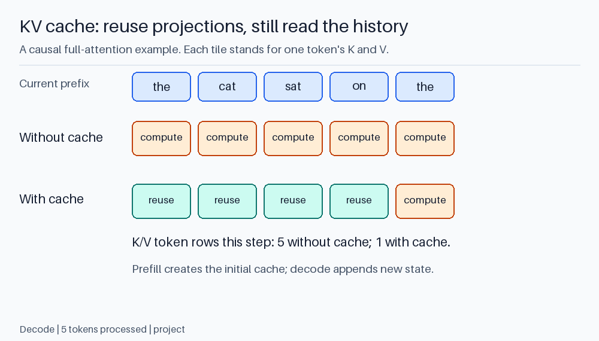
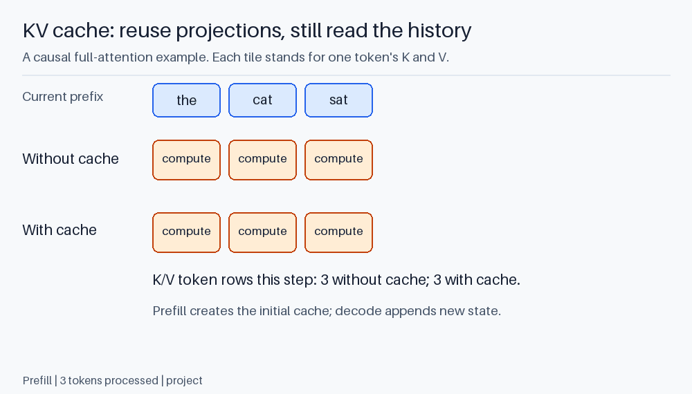
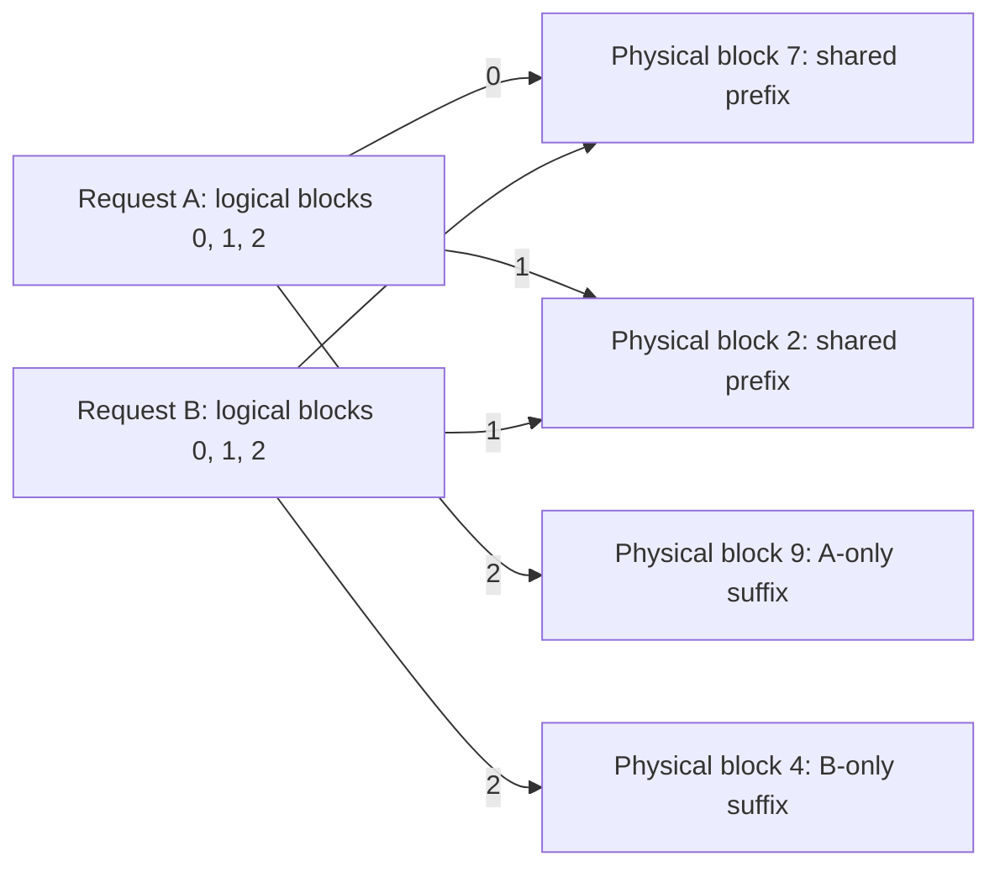
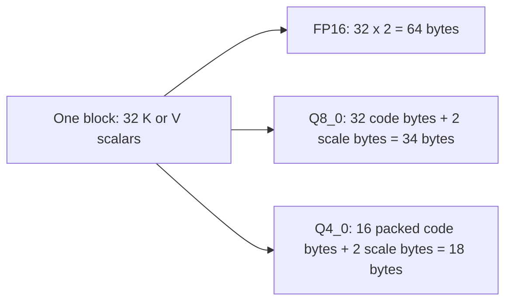

# KV cache as a serving resource

The foundations explain why earlier keys and values can be reused during
causal generation. Infrastructure work starts with the next questions:

```text
How much state is retained?
Who owns it?
How is it allocated and reclaimed?
Can requests share it?
What changes when its precision is reduced?
```

Unlike weights, cache state belongs to a particular sequence or compatible
prefix. It changes while requests run.

## 1. Follow one conversation

Prefill computes state for the input prefix. Each decode step appends new state
where the architecture retains per-token K/V. A later turn may reuse the
previous prefix if the runtime recognizes it and retains compatible state.

If the application edits an earlier message, the later state was computed from
a different prefix. It cannot be reused as though nothing changed. Changed
templates, position handling, adapters, or model weights can also invalidate reuse.

The application still needs the conversation's logical content. A KV cache is
not a durable chat database, a human-readable summary, or a substitute for
history management.

For ordinary full attention, a cache can have dimensions like:

```text
[layers, sequences, KV_heads, token_positions, head_dim]
```

Physical storage may be transposed or paged to suit kernels. Never infer tensor
layout merely from the conceptual axes.



<details>
<summary>Animate prefill and three cached decode steps</summary>



</details>

Orange tiles are newly computed K/V; green tiles are retained state. The blue
read phase shows attention for the **last query only**. Prefill also computes
earlier queries with their causal masks. Each new decode query still reads
the retained full-attention history: caching projections does not eliminate
that work. The last displayed word is the token being processed, not the next
token sampled from its output.

## 2. Size it from the architecture

For equal K/V widths across conventional layers:

```text
bytes = 2 * layers * KV_heads * head_dim * tokens * bytes_per_value
```

For independent sequences, sum their retained lengths. Add physical allocation
rounding and other state.

With 32 layers, 8 KV heads, dimension 128, and FP16:

```text
bytes per token = 2 * 32 * 8 * 128 * 2 = 131,072 bytes = 128 KiB
8,192 tokens = 1 GiB per sequence
4 independent 8K sequences = 4 GiB
```

Query-head count does not replace KV-head count in this equation.
GQA shares K/V between query heads, reducing stored rows without requiring
identical attention from those queries.

Model families need different accounting:

| Architecture | Relevant state |
| --- | --- |
| Full attention | Retained per-token keys and values |
| Sliding-window attention | Usually a bounded recent window per relevant layer, plus any special retained state |
| Multi-head latent attention | Compressed latent representation and any additional positional components |
| Recurrent/state-space hybrid | Recurrent states plus K/V in full-attention layers |

A model's parameter count alone does not tell you its cache footprint.
Two models of similar weight size can have very different long-context costs.

## 3. Logical length versus allocated capacity

A runner may reserve a contiguous buffer for the maximum context before
processing the first token. Another allocates blocks as sequences grow.
Measured memory therefore need not rise one token at a time.

If one token costs 128 KiB and a block contains 16 token slots, one block
represents 2 MiB. A sequence of 17 tokens needs two blocks: 32 slots, with 15
unused at that moment.

Paging limits wasted tail capacity and permits noncontiguous allocation.
It does not reduce the information stored for live tokens. A page table maps
logical sequence positions to physical cache blocks.

Prefix sharing can let compatible requests reference the same blocks.
When one request appends or diverges, it needs private state; a partially filled
shared block can require copy-on-write or another allocation policy.

Reference counting and cancellation handling matter. A disconnected client should
not retain cache indefinitely, and a shared prefix must not be freed while
another request still uses it.



Here the first two logical blocks are full, compatible prefix blocks, so two
requests reference four physical blocks rather than six. Logical order is
not physical address order. Deleting A releases block 9; blocks 7 and 2
remain live for B. Divergent suffixes cannot share the same writable state.

## 4. Prefix caching is not a conversation lookup by meaning

Reusing computation requires compatible token prefixes and model configuration,
not merely semantically similar text. Even a changed timestamp near the start
of a prompt can prevent a long prefix match.

Put stable instructions before changing request content when that matches the
application's semantics. Do not reorder instructions solely for cache hits if
it changes model behavior.

Cache keys need to distinguish model revisions, adapters, position settings,
and any other inputs that alter the computed state. Multi-tenant systems also
need an isolation policy: shared infrastructure must not expose another user's
private prefix or cached outputs.

Measure hit rate and actual avoided prefill work. A high hit rate on short
prefixes may save less than a modest hit rate on very long prefixes.

## 5. Quantizing K and V

Cache quantization stores approximate state in lower precision. For Q8_0,
32 values occupy 34 bytes including the scale, giving 1.0625 bytes per value.
For Q4_0, 32 values occupy 18 bytes, giving 0.5625 bytes per value.

Relative to FP16 storage:

```text
Q8_0: 1.0625 / 2 = 53.125%
Q4_0: 0.5625 / 2 = 28.125%
```

These ratios exclude runtime padding and auxiliary buffers.



The block is a quantization group, not a cache-allocation page. Each arrow is
an alternative storage choice for those same 32 scalars, not three copies
that a runtime must retain. Lower storage does not by itself establish lower
latency or acceptable attention error.

K and V influence attention differently:

```text
scores = q @ K^T / sqrt(head_dim)
weights = softmax(scores)
output = weights @ V
```

An error in K can change where attention goes. An error in V changes what gets
blended. Neither is universally more sensitive; the model, input distribution,
and quantization layout matter.

A hybrid choice might keep K in Q8 and V in Q4. That is not equivalent to
quantizing both to a fractional average bit width; separate kernels, layout,
and precision effects remain.

Some cache methods preserve a recent high-precision window and quantize older
state. Quantization can also use different grouping directions for K and V
because their value distributions differ. KIVI is one published example of
asymmetric cache quantization; it is not the same algorithm as setting
Ollama's cache type to `q4_0`.

## 6. Computation and quality costs

A low-bit cache needs a compatible attention kernel. Efficient kernels can
dequantize tiles while computing attention instead of reconstructing the whole
cache in high precision first.

This connects cache quantization with FlashAttention implementations, but
the mathematical ideas are distinct. FlashAttention avoids materializing the
full score matrix. Cache quantization reduces persistent-state precision.

Short-context decode may spend relatively little time reading K/V compared
with reading weights. At long context, cache traffic can become a larger cost.
A format that saves memory may still lose time to conversion overhead.

Quality evaluation should include more than short chat:

| Workload | Why it matters |
| --- | --- |
| Long exact retrieval | Tests whether specific earlier information survives use of the cache |
| Multi-turn instructions | Tests retention of constraints across growth |
| Code with distant definitions | Tests dependence on earlier context |
| Long generation | Exposes repeated use of quantized state |
| Position-sensitive tasks | Detects failures hidden by placing the answer near the end |

Use a higher-precision-cache reference with the same weights and decoding
settings. Exact output differences are not automatically quality failures;
evaluate the task.

## 7. The Qwen hybrid example

Qwen3.5-4B has eight full-attention text layers with four KV heads and head
dimension 256. At a 4K context:

```text
FP16 conventional K/V: 128 MiB
Q8_0 storage arithmetic: 68 MiB
```

The theoretical saving is 60 MiB for those arrays. Recurrent state in its other
24 layers is separate. A cache flag does not necessarily quantize that state.

For a conventional model with 32 such attention layers, the corresponding
cache saving would be four times larger. The best target for optimization
changes with architecture.

Run the existing calculator:

```powershell
python 02_kv_cache_size.py --context 32768 --sequences 2
```

Its storage formulas are shared in `cache_math.py`. The calculator deliberately
does not announce a total VRAM fit because weights, recurrent state, and workspace
are not included.

## 8. Design a real KV experiment

Use a matrix of **actual prompt length**, **configured capacity**, **cache type**,
and **parallel sequences**. Change one axis at a time for the first comparisons.

Record:

```text
model artifact and architecture
effective cache type and attention backend
allocated capacity and actual input/output lengths
prefix reuse policy
GPU memory sampling and runner allocation reports
prefill time, first answer, decode rate, and task results
```

For an Ollama experiment, the cache type is a server-level setting. Restart the
intended process and inspect logs. The original laptop launcher explicitly sets
FP16; setting Q8 in a different terminal will not override that line.

Current runtime support can differ for K and V, hybrid models, and attention
backends. Establish that the setting took effect before interpreting a graph.

At the end, answer a practical question: did the change allow useful longer
contexts or more concurrency while meeting a latency and quality target?
A lower memory number by itself does not establish that result.

### Allocation exercise

Three independent sequences retain 1, 16, and 17 tokens. Blocks contain 16 slots.
How many blocks are needed without prefix sharing?

<details>
<summary>Answer</summary>

One, one, and two blocks: four blocks total, or 64 allocated slots for 34 live
tokens. Paging bounds tail waste per sequence but does not eliminate it.

</details>

References: [PagedAttention](https://arxiv.org/abs/2309.06180),
[KIVI](https://arxiv.org/abs/2402.02750),
[Ollama cache settings](https://docs.ollama.com/faq),
[llama.cpp quantized block definitions](https://github.com/ggml-org/llama.cpp/blob/master/ggml/src/ggml-common.h).
