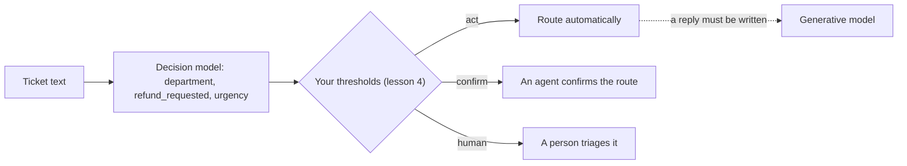

# 1. Decisions, not text

A program that routes a support ticket needs one of a few fixed answers, not a
paragraph. This lesson compares asking a generative model for that answer with
asking a typed decision model. It then introduces Jev and Laya.

## A generative model has to be parsed

The [connected lab](../pipeline/README.md) routes tickets with a generative model.
Its prompt, from [`pipeline/data.py`](../pipeline/data.py), is:

```text
Route this support ticket. Reply only with JSON {"category":"billing"}, {"category":"account"}, or {"category":"technical"}.
Ticket: I was charged twice for my March invoice. Please refund the duplicate payment.
```

The model then writes its reply one token at a time. A well-trained model usually
follows the instruction, but nothing in the interface forces it to. The reply can be
a sentence, JSON with an extra key, a category that was not offered, or text cut off at
the token limit. [`pipeline/evaluate.py`](../pipeline/evaluate.py) therefore parses every
reply. Anything other than exactly `{"category": ...}` with one of the three categories
counts as `invalid`.

Constrained decoding ("JSON mode") can guarantee that the reply parses, but the program
still receives a single label. To see how close the runner-up was, it must request token
log-probabilities, if the runtime exposes them, and map tokens back to labels itself.

## A decision model answers a question

A typed decision model takes the content, called the **state**, and one or more named
**questions**. Each question has a type, and its **criteria** list the answers it allows:

```json
{
  "model": "jev-latest",
  "state": "I was charged twice for my March invoice. Please refund the duplicate payment.",
  "questions": {
    "department": {
      "type": "choice",
      "instructions": "Which team should handle this support ticket?",
      "criteria": {
        "billing": "Charges, invoices, payments, or refunds.",
        "account": "Signing in, passwords, profile details, or account access.",
        "technical": "Errors, crashes, or features that do not work.",
        "other": "Anything else, such as pricing questions before buying or general feedback."
      }
    }
  }
}
```

The answer comes back under the same name. The numbers below are **invented to show the
shape**; they are not output from either model:

```json
{
  "answers": {
    "department": {
      "type": "choice",
      "choice": "billing",
      "probabilities": {"billing": 0.70, "account": 0.10, "technical": 0.10, "other": 0.10}
    }
  }
}
```

Real responses also carry `model`, `usage`, and a `confidence` field. Lesson 3 explains
them. Three properties matter to the program that receives this answer:

1. **The answer is always one of your labels.** Jev's API schema defines `choice` as
   "the name of the choice with the highest probability among the question's criteria".
   Laya returns the most probable of the options you listed. There is no `invalid` case.
2. **Every allowed answer has a probability.** The program can see that `account` was
   a distant second and decide how far to trust `billing` (lessons 3 and 4).
3. **One request can ask several questions.** Lesson 2 asks three questions about the
   same ticket in one call.

## Three question types

| Type | It asks | The answer |
| --- | --- | --- |
| `choice` | Which one of these labels applies? | The most probable label, plus a probability for each label |
| `noul` | Does this statement hold? | `noul`: the probability of yes, from 0 to 1 |
| `score` | Where on this ordered scale does it fall? | `score`: the probability-weighted average level, plus a probability for each level |

`noul` is the name both APIs use for a yes/no question.

## Where a decision model fits

TypeSafe AI calls Jev a "System One" model, and its endpoint is `/v1/systemone`. The name
echoes the "System 1" of dual-process psychology, popularized by Daniel Kahneman: fast,
automatic judgments, as opposed to slow, deliberate reasoning. In an application, the
decision model makes the many small, fixed-format judgments. A generative model is kept
for writing replies and for open-ended reasoning:



## Jev and Laya

| | Jev | Laya |
| --- | --- | --- |
| Made by | TypeSafe AI | Convai Innovations |
| Weights and architecture | Not published | Apache-2.0 weights on Hugging Face; bidirectional text encoders |
| Models | Chosen with the `model` field; `GET /v1/models` lists them | `laya`: ModernBERT-large, 421M parameters, 512-token context, English. `laya-multilingual`: mmBERT-base, 322M parameters, 1,024 tokens. `laya-typed-decisions`: ModernBERT-large, 421M parameters, fine-tuned on Laya's typed-decisions benchmark |
| Where it runs | TypeSafe's servers | Your CPU or GPU |
| How you call it | `POST https://api.typesafe.ai/v1/systemone`, or the `typesafe-sdk` Python package | `laya.Router().predict(...)` in Python, or the same HTTP API through `laya-serve` |
| What a request costs | Billed by input tokens, reported as `usage.input_tokens` | Your own hardware |

Laya's README says its base checkpoints are close to chance on its own typed-decisions
benchmark without fine-tuning. It reports 0.362 accuracy for the English checkpoint,
against 0.318 for random answers and 0.461 for always giving the most common answer. The
checkpoint fine-tuned on that benchmark's training split reaches 0.766. The README
describes Laya as "a fast base to specialise, not a zero-shot decision engine". These are
the vendor's figures, not measurements from this course. Lesson 6 shows how to measure
either model on your own tickets.

### How Laya reads a question

Laya's source code shows how it turns a question into model input. Each question becomes
one sequence. Every option starts with a `[MASK]` token:

```text
[CLS] choice question: Which team should handle this support ticket? [SEP]
[MASK] billing: Charges, invoices, payments, or refunds.
[MASK] account: Signing in, passwords, profile details, or account access.
[MASK] technical: Errors, crashes, or features that do not work.
[MASK] other: Anything else, such as pricing questions before buying or general feedback. [SEP]
I was charged twice for my March invoice. Please refund the duplicate payment. [SEP]
```

The encoder attends in both directions. In the
[causal attention](../foundations/03-inside-a-transformer.md#causal-masking) of a text
generator, each position sees only earlier positions. Here every position sees the whole
sequence, so the vector at each `[MASK]` can draw on the question, its own option text, and
the ticket. A small head on top of the encoder turns each `[MASK]` vector into one logit.
Laya divides the logits by a temperature stored with the checkpoint and applies softmax
across the options. No token is generated.

Score levels are rendered as `level 0: ...`, `level 1: ...`, and so on. The two noul
options are `false: ...` and `true: ...`. TypeSafe has not published how Jev works, so do
not assume it uses the same layout.

## When not to use one

A decision model is the wrong tool when:

- **The output is text.** A reply, a summary, or an explanation needs a generative model.
- **The answers are not known in advance.** An open set of product names or free-form
  extraction does not fit a fixed list of labels.
- **A rule is exact.** "Invoice total is over 500" is a comparison in code, not a question
  for a model.
- **The decision needs information that is not in the state.** A model cannot check your
  refund policy or the customer's order history unless that text is in the request.
  Probabilities about missing information can still look confident.

References: [TypeSafe Python SDK wire schema, v0.7.2](https://github.com/typesafe-ai/typesafe-sdk-python/blob/v0.7.2/src/typesafe_sdk/_schemas/models.py),
[Laya README, v0.3.21](https://github.com/NandhaKishorM/laya/blob/v0.3.21/README.md),
[Laya sequence layout (`build_sequence`)](https://github.com/NandhaKishorM/laya/blob/v0.3.21/laya/common.py),
[ModernBERT](https://arxiv.org/abs/2412.13663).
