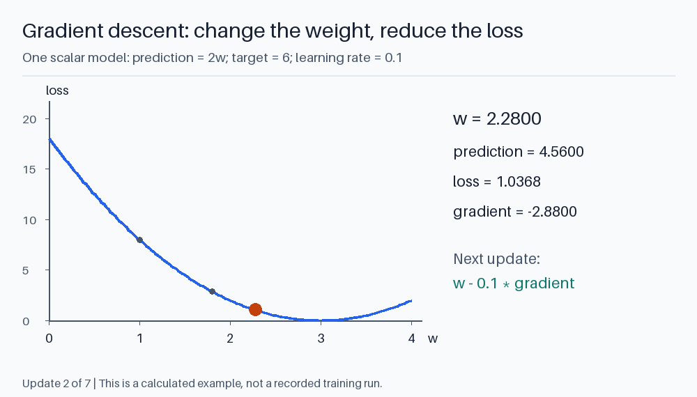
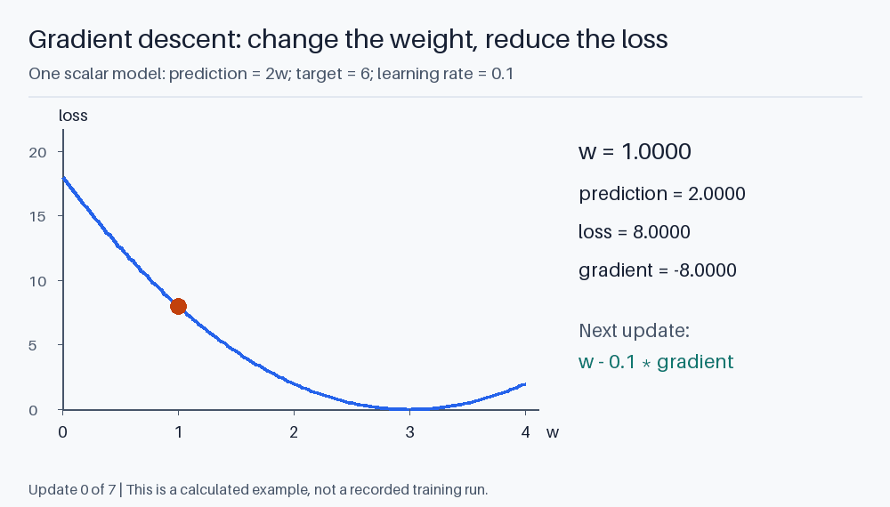

# 2. How prediction changes a weight

A model starts with numbers that usually produce poor predictions. Training
repeatedly asks three questions:

1. What did the model predict?
2. How bad was that prediction?
3. In which direction should each parameter move?

The first is a forward pass, the second is a loss function, and the third uses
gradients and an optimizer.

## Begin with one weight

Take `prediction = w * x`, with `x = 2`, desired output `y = 6`, and initial
weight `w = 1`. The model predicts 2.

Use squared error with a convenient factor:

```text
loss = 0.5 * (prediction - y)^2
     = 0.5 * (2 - 6)^2 = 8
```

The derivative of loss with respect to `w` is:

```text
d_loss/d_w = (prediction - y) * x = -4 * 2 = -8
```

A gradient-descent update with learning rate 0.1 is:

```text
w_new = w - learning_rate * gradient
      = 1 - 0.1 * (-8) = 1.8
```

The new prediction is 3.6 and the loss is 2.88. The update improved the example.
An excessively large learning rate can jump past the useful region and increase
loss instead.

The derivative tells us how loss responds to a small change. It does not contain
a symbolic instruction such as "multiply by three." Training discovers parameters
through many numerical updates.



<details>
<summary>Animate seven gradient-descent updates</summary>



</details>

The curve is `0.5 * (2w - 6)^2`, not a fitted illustration. The first move is
`1 -> 1.8`, then `1.8 -> 2.28`. Notice that the steps shrink as the gradient
approaches zero. The animation uses this one fixed example; real minibatch
losses need not decrease at every step.

## A neural layer combines features

A dense layer computes:

```text
h = activation(x @ W + b)
```

`W` is a learned matrix and `b` a learned bias. The activation is nonlinear:
examples include ReLU, GELU, and SiLU. Some model layers omit biases.

Without a nonlinearity between layers, two linear maps collapse into one:

```text
(x @ W1) @ W2 = x @ (W1 @ W2)
```

Nonlinearities let stacked layers express relationships that one linear map cannot.
More layers and parameters increase capacity, but useful learning still depends
on data, objectives, optimization, and architecture.

During a forward pass, intermediate values such as `h` are **activations**.
They depend on the current input. `W` and `b` are **parameters** shared across
inputs. The distinction will later explain why a model needs memory beyond
its weight file.

## Language models use a different loss

For next-token prediction, the target is a vocabulary entry. Cross-entropy for
one example is the negative log probability assigned to the correct token:

```text
loss = -ln(p_correct)
```

| Probability of correct token | Loss, using natural logarithms |
| --- | ---: |
| 0.8 | 0.223 |
| 0.2 | 1.609 |
| 0.01 | 4.605 |

This penalizes confidently wrong predictions strongly. It also rewards increasing
the correct token's probability even if that token was already the most likely.

For softmax followed by cross-entropy, the logit gradient is particularly simple:

```text
d_loss/d_logits = probabilities - one_hot(target)
```

With predicted probabilities `[0.7, 0.2, 0.1]` and target ID 1:

```text
gradient = [0.7, -0.8, 0.1]
```

Gradient descent lowers the incorrect logits and raises the correct one.
For a batch, gradients are usually averaged over the examples or valid tokens.

A **batch** is the group of examples used for an update. An **epoch** is a pass
through the training dataset. A **step** usually means an optimizer update,
though gradient accumulation can combine several smaller batches before a step.
Our script uses its entire tiny training set for each update.

This objective does not directly say "be truthful," "cite a source," or
"write secure code." It says to assign probability to the training targets.
Later training stages and application design address additional requirements.

## Backpropagation is the chain rule

If logits depend on a hidden state and the hidden state depends on an embedding,
the embedding affects the loss indirectly. Backpropagation follows that dependency
chain and computes the derivatives efficiently.

For `h = tanh(E[token_id])` and `logits = h @ W + b`:

```text
dW = h^T @ d_logits
db = sum of d_logits over the batch
dh = d_logits @ W^T
dE_for_this_token = dh * (1 - h^2)
```

When a token occurs more than once in a batch, its embedding-row gradients must
be **added**, not overwritten. The training example uses `np.add.at` for this.

PyTorch and similar frameworks track these dependencies and compute gradients
automatically. Our small example writes them out so the update remains visible.
It compares one analytic derivative with a finite-difference estimate:

```text
gradient approximately = (loss(w + epsilon) - loss(w - epsilon)) / (2 * epsilon)
```

Finite differences are useful for checking a small example, but too expensive
to train a large network parameter by parameter.

## Actually train a small next-token model

Run:

```powershell
python foundations\02_train_a_small_model.py
```

The script trains on short sequences such as:

```text
red blue red blue ...
sun moon sun moon ...
```

It sees pairs like `red -> blue`. It learns an embedding matrix and a nonlinear
classifier from the current token to the next token.

This is a neural **bigram** model: only the immediately preceding token influences
the prediction. The name describes its context limit, not its parameter precision.
It is small enough that a lookup table of transition counts could solve the
task too. Using a neural model lets us inspect the same gradient machinery used
in larger networks.

The script prints initial loss, final loss, validation loss, next-token predictions,
and a generated sequence. The data are synthetic and deterministic; validation
contains new sequences using the same simple transition rule. Success demonstrates
that optimization learned the rule, not that it learned language.

Notice what it cannot do. If two sentences end in `"bank"` but require different
next words based on earlier context, this model cannot distinguish them.
Both inputs select the same embedding row and therefore the same distribution.
The transformer chapter addresses that missing context.

## Training, validation, and generalization

**Training data** are used to update weights. **Validation data** help select
settings and checkpoints. A **test set** should be reserved for final evaluation.
Repeatedly choosing settings based on test scores turns the test set into another
validation set.

Training loss can decrease while performance on new examples worsens. That is
overfitting: the model captures details that do not generalize.
Duplicate examples or benchmark contamination can also make held-out performance
look better than it is. Separate meaningful sources or time periods when the
application requires that kind of generalization.

Useful controls include data quality, regularization, weight decay, dropout,
and early stopping. They address different failure modes; none replaces a
representative evaluation set.

**Perplexity** is `exp(mean cross-entropy)` when loss uses natural logarithms.
A model assigning uniform probability over V tokens has perplexity V.
Lower perplexity means better average prediction under that tokenizer and dataset.
Comparing perplexities from different tokenizers can be misleading because the
prediction units changed.

## Why training needs more memory than inference

Inference mainly needs weights, temporary activations, and any retained state.
Gradient-based training additionally needs gradients and usually saved forward
activations. An optimizer such as Adam maintains extra state for each parameter.

For illustration, four billion FP16 weight values alone occupy eight billion
bytes. Gradients, optimizer moments, master copies where used, and activations
can multiply that memory requirement. Exact accounting depends on precision,
optimizer, sharding, and checkpointing.

The tiny model uses plain gradient descent. Adam adapts step sizes using moving
statistics of gradients. A learning-rate schedule changes the step size over
training. Gradient clipping limits unusually large updates.

Running a quantized model on a laptop therefore does not imply that the laptop
can train that model from scratch. Inference and training retain different data
and do different work.
