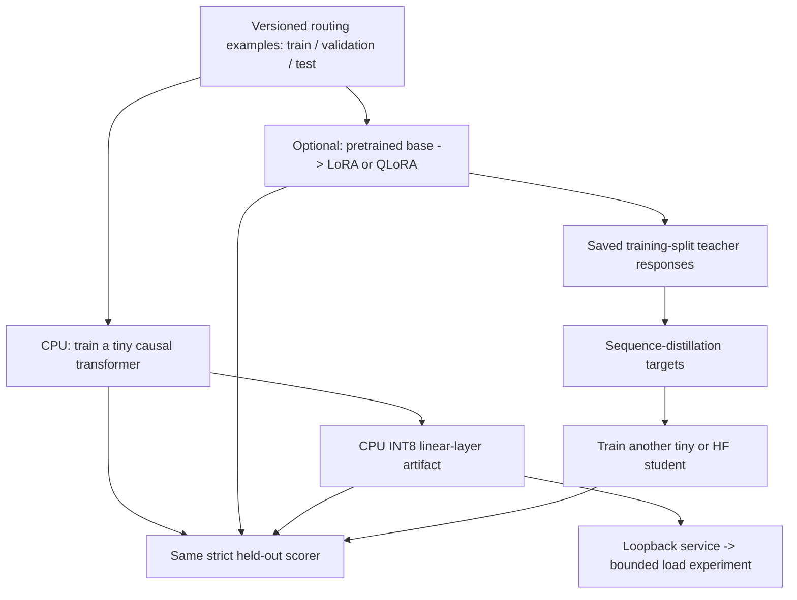

# One task, from training to a measured service

The task is deliberately small: read a synthetic support ticket and return
exactly one JSON object:

```json
{"category":"billing"}
```

The other categories are `account` and `technical`. This keeps correctness
inspectable while the surrounding system changes. It is not a benchmark of
general language understanding.

There are two model paths. The **CPU path** trains a tiny transformer from random
weights, quantizes its linear layers, and serves that artifact. The **pretrained
path** evaluates and adapts a supported Hugging Face causal LM. They share data
and scoring, not weights or tokenizers. A checkpoint from the tiny model cannot
be passed to the HF adapter runner.



## Generate the shared dataset

No framework or model download is needed for this step:

```powershell
python -m pipeline.data --output results\pipeline\data
```

This creates 72 training, 36 validation, and 36 test examples plus a content
digest. Wording templates are split as groups; product nouns are shared.
Duplicate normalized prompts and cross-split template IDs are rejected.
The validator does not detect every kind of semantic leakage in arbitrary data.

Every record has an ID, prompt, response, category, split, and template ID.
The prompt contains the complete task instruction. Predictions use the same ID,
so scoring does not depend on file order.

Do not regenerate the dataset into an existing directory. Existing output paths
are rejected rather than silently replaced. Use a new run directory when making
a controlled change.

## Train, adapt, and compress

Install only the environment needed for the path:

- [CPU transformer walkthrough](TINY.md): initialization, masked loss, training,
  restart, prediction, and dynamic INT8 export.
- [Pretrained adaptation walkthrough](HF.md): checkpoint identity, prompt/label
  inspection, LoRA/QLoRA, prediction, restart, and merged export.
- [Environment recipes](ENVIRONMENTS.md): isolated CPU/CUDA dependencies and
  compatibility boundaries.

The experiment sequence is **baseline -> training -> evaluation -> compression
-> evaluation again**. Keep the original high-precision artifact. A quantized
model that loads but gives the wrong category has not preserved the task.

Use validation results when selecting settings. Reserve the test split for the
final comparison; repeatedly choosing a setting based on test accuracy turns
the test set into training feedback.

## Score outputs without hiding failures

Start with a baseline that does not need a model. It always returns the most
frequent category in the training split, breaking ties in the documented
category order:

```powershell
python -m pipeline.baseline --output results\pipeline\majority-test.jsonl
python -m pipeline.evaluate --predictions results\pipeline\majority-test.jsonl --output results\pipeline\majority-score.json
```

On this balanced dataset that is 12/36 correct with valid JSON on every example.
Training loss falling is not enough if free-running answers cannot beat it.

After either model path writes prediction JSONL:

```powershell
python -m pipeline.evaluate --data results\pipeline\data --split test --predictions results\pipeline\tiny-test.jsonl --output results\pipeline\tiny-score.json
python -m pipeline.evaluate --data results\pipeline\data --split test --predictions results\pipeline\int8-test.jsonl --output results\pipeline\int8-score.json
```

The scorer requires a JSON object with exactly the `category` key and one of the
three allowed strings. A correct word surrounded by prose or Markdown fences is
invalid. It records accuracy, schema validity, missing predictions, output-limit
finishes, a confusion table, and available latency percentiles.

Missing predictions count against accuracy. Duplicate or foreign IDs are errors,
not extra chances to answer. Percentiles use linear interpolation and report
their sample count. Thirty-six examples cannot establish a reliable production
tail-latency or quality estimate.

For the final comparison, record artifact bytes, accuracy, invalid responses,
generation latency, and load-test throughput. CPU INT8 and GPU NF4 are different
implementations; do not interpret their bit widths as an apples-to-apples speed
comparison.

## Sequence distillation

First use either runner's `predict` command on **the training split**, saving
teacher responses as `results\pipeline\teacher-train.jsonl`. Record the actual
teacher identity: a checkpoint revision or digest of the local artifact.

For the already-trained tiny teacher:

```powershell
.\pipeline\.venv\Scripts\python.exe -m pipeline.tiny predict --artifact results\pipeline\tiny-fp32 --split train --output results\pipeline\teacher-train.jsonl
$teacherDigest = (Get-FileHash results\pipeline\tiny-fp32\model.pt -Algorithm SHA256).Hash.ToLowerInvariant()
python -m pipeline.distill --data results\pipeline\data --predictions results\pipeline\teacher-train.jsonl --teacher "tiny-fp32-sha256:$teacherDigest" --output results\pipeline\distilled-data
.\pipeline\.venv\Scripts\python.exe -m pipeline.tiny train --data results\pipeline\distilled-data --output results\pipeline\student-fp32 --dim 32 --layers 1 --steps 200
```

The one-layer width-32 student has fewer parameters than the default teacher.
For an HF teacher, use its corresponding prediction command and actual revision.
The preparation command rejects invalid or
missing teacher answers, records their IDs, and reports teacher agreement with
the original training labels. It preserves the original label as `gold_category`
but trains on the teacher's category, including valid teacher mistakes.

Validation and test files keep their original gold responses. Train a **new**
student with `--data results\pipeline\distilled-data`, then compare its held-out
accuracy with a student trained on the original labels using matched settings.
Keep their model sizes and training budgets explicit.

This is sequence distillation: next-token cross-entropy on teacher-written JSON.
It is not the temperature-scaled vocabulary KL experiment in the NumPy chapter.
Because this task has only three short answers, a correct teacher supplies little
extra information beyond the original label. The lab can show no gain or a loss;
do not manufacture an improvement by removing inconvenient test examples.

## Serve and measure

After creating the CPU INT8 artifact, start this in a separate terminal:

```powershell
.\pipeline\.venv\Scripts\python.exe -m pipeline.serve --artifact results\pipeline\tiny-int8 --port 11436
```

The server binds only to `127.0.0.1`. `/health` responds after the model is loaded.
It accepts one generation at a time and rejects overlapping requests with HTTP
429. It intentionally has **no continuous batching, request queue, or streaming**.
Disconnecting a client does not interrupt an already-running generation; that
slot is released when generation finishes. This is not a production server.

For a local merged HF export, use the same endpoint with
`--backend hf --artifact <merged-directory>` and an explicit `--device cpu`
or `--device cuda` in the corresponding environment. Loading this local export
does not access the hub. The load client's `--backend local` selects the
teaching server's HTTP protocol for either model backend.

From another terminal:

```powershell
python -m pipeline.benchmark --backend local --mode closed --requests 20 --concurrency 1 --output results\pipeline\load-sequential.json
python -m pipeline.benchmark --backend local --mode open --rate 5 --requests 20 --concurrency 4 --output results\pipeline\load-arrivals.json
```

Closed-loop traffic waits for client slots to free. Open-loop traffic schedules
arrivals independently of response completion. If the client in-flight limit
is reached, an arrival is recorded as **client-dropped**, not queued indefinitely
or silently omitted. Server 429 responses are counted separately.

The report includes every offered request, success/failure counts, successful
request latency percentiles, and aggregate generated tokens per elapsed second.
Successful latency alone is not an overload metric: read it alongside failures.
Repeated IDs are intentional for load generation; load reports are not prediction
JSONL and cannot be passed directly to the accuracy scorer.

There is no time-to-first-output measurement for the non-streaming tiny endpoint.
To measure streamed first output against an **already running** local Ollama
model instead:

```powershell
python -m pipeline.benchmark --backend ollama --url http://127.0.0.1:11434 --model qwen3.5:4b --mode closed --requests 10 --concurrency 1 --output results\pipeline\ollama-load.json
```

Use the actual server port and installed model name; this command does not pull
a model. First output can include reasoning content if a model emits it despite
the requested setting. It is a client-observed stream event, not a kernel timer.
The socket timeout is per blocking network operation, not a total run deadline.
No public endpoints, proxies, redirects, or external load targets are supported.

## Follow the work inside the model

[Mechanism exercises](EXPERIMENTS.md) add an executable projection profiler,
the online-softmax recurrence, and cache pages with reference counts and
copy-on-write. They also connect optimizer state, clipping, and scheduling
to the training runners.

## Evidence and boundaries

The [first CPU result](CPU-RESULT.md) includes the unsuccessful quality outcome:
the trained tiny model scored below the majority baseline, and its smaller INT8
artifact was slower in that one generation pass. It is a worked interpretation,
not a recommended deployment configuration.

The offline suite runs with:

```powershell
.\pipeline\.venv\Scripts\python.exe -m unittest discover -s tests -v
```

CI uses CPU environments and locally constructed models, with hub access disabled.
It does not establish CUDA, bitsandbytes, multi-GPU, or pretrained-model quality.
Real model downloads and GPU experiments remain explicit user-run operations.
Direct dependency versions are pinned; save the full resolved environment beside
each experiment as described in the environment guide.

The synthetic task and single-slot server are starting points. A production
serving backend, custom GPU kernels, distributed recovery, and broader task
evaluation remain outside this implementation.
